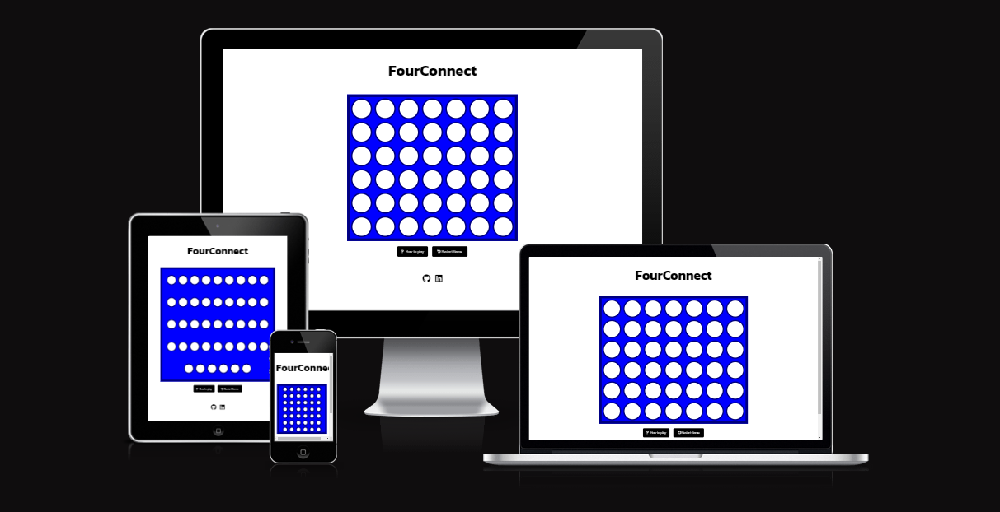
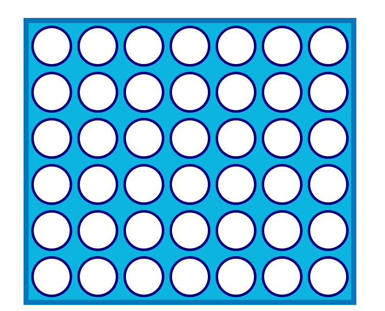
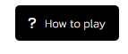
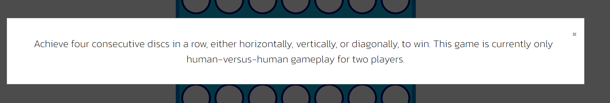
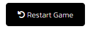
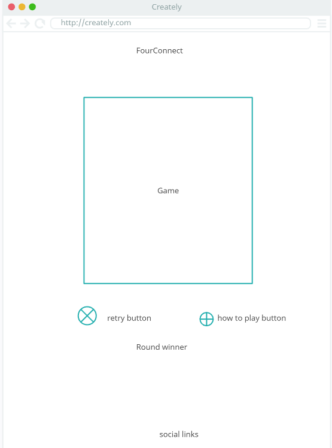

# FourConnect - Connect4 Game

**Overview**

FourConnect is a modern twist on the classic Connect 4 game, designed for players of all ages. This JavaScript-based game offers a convenient and enjoyable way to challenge your strategic thinking and have fun with friends or family. Whether you are a pro or a newcomer, FourConnect is here to entertain and sharpen your strategic skills. Currently, the game supports human-versus-human gameplay, offering the perfect oppurtunity for friendly competition.

## Features

### General features

**Game Area**

The game area in FourConnect will allow users to place the tiles in the areas they choose.

**Winner Display**

The color of the player that wins the game appears over the game board.

**How to Play Button**
I have added a How to Play button, when this button is clicked on it opens up a pop-up explaining how the game works.

**Restart Game Button**

There is also a button that restarts the game if the players wish to start a new round.

### Features Left to Implement

- Future updates could include a "play vs computer" mode.
- A line that goes through the winning tiles.
- Allow users to costumize their own tiles.
- Allow users to switch to dark mode if they wish.

## Testing

The project has undergone extensive testing to ensure that all features work as intended. The game has been tested on various browsers and screen sizes to ensure responsiveness and compatibility.

### Validator Testing

- **HTML:** Passed through the official W3C validator with no errors.
- **CSS:** No errors found when passing through the official (Jigsaw) validator.
- **JavaScript:** Passed through the official JSHint validator with no errors.

### Unfixed Bugs

Currently, there are no unfixed bugs in the project, and all features work as expected.

### Wireframe

There have been some changes since the wireframe was created. I initially intended on putting the display winner area beneath the buttons. However, as the project progressed, I thought it made more sense UX wise to have the display winner area above the game.

## Deployment

The project has been deployed to GitHub Pages for easy access. You can access the live version of the game here: [FourConnect Game](https://alex025x.github.io/FourConnect/).

## Credits

**Content:**

- I used the following content as inspiration for some parts of my site, all content was created by myself.
 Connect4 game JS tutorial: <https://www.youtube.com/watch?v=TGJlcQWPHJc>

- The checkWinner function was inspired using the "sliding window" technique from this video: <https://www.youtube.com/watch?v=JWHjqjk9ZYc>
 

**Media:**

- The favicon was created using Canva.
- Icons used in the footer were sourced from Font Awesome.
  

## Acknowledgements

- Code Institue training material
- My mentor Jack Wachira
